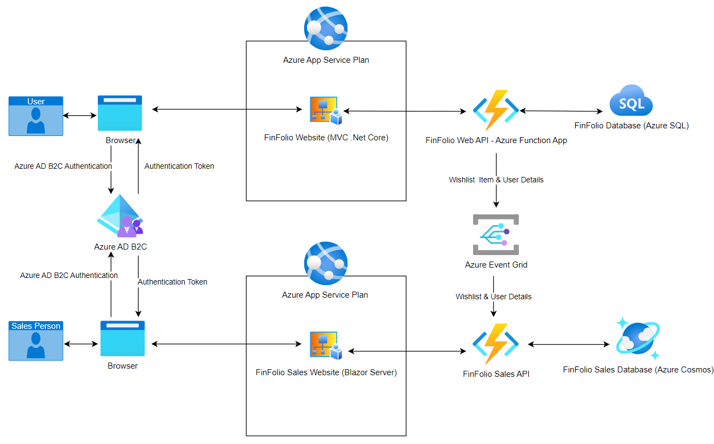

# Fin-Folio-App

This project was created for showcasing in my portfolio. Project is created using ASP.Net Core MVC and Azure Functions as backend. Clean architecture and Microservices achitecture patterns are followed for creating this project.

# High Level Design Diagram

